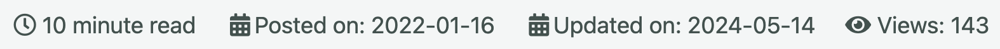

# Count Page Views


This repo is a simple backend server that retrieve the page count using [Google Analytics Data API](https://developers.google.com/analytics/devguides/reporting/data/v1?hl=zh-tw)\
The tool is build to integrate with **static page** by default, specifically GitHub pages([Minimal Mistakes](https://mmistakes.github.io/minimal-mistakes/))

## Features
+ Aggregate page view count (include redirect URL)
+ Cache page view count with Redis to prevent API rate limit
    + The http response is also cached to prevent unnecessary API call, default to `1 day`(since the view count is not updated frequently by the Google Analytics)
+ Easy deployment with Kubernetes(Helm Chart), Docker-Compose, or standalone

## Prerequisites
+ Enable [Google Analytics Data API](https://developers.google.com/analytics/devguides/reporting/data/v1?hl=zh-tw)
+ Enable Google Analytics and have some page view data

## Environment Variables
copy [.env.example](./.env.example) to `.env` and fill in the following variables

| Name | Description |
|:--|:--|
| PORT | Port number of the server |
| LOG_LEVEL | Log level of the server |
| CORS | Allow origin url for CORS |
| REDIS | Redis connection string |
| GOOGLE_APPLICATION_CREDENTIALS | Path to the Google Cloud credential file |
| ID | Google Analytics View ID |
| DOMAIN | Domain name of the website |
| START_DATE | Start date of the query |

## API
| Method | Path | Description | Query Parameters |
|:--|:--|:--|:--|
| GET | `/views` | Get the page view count | `url`: URL of the page |
| POST | `/views` | Renew page view count for page ||

## Build
```shell
$ make build
```

## Run
### Standalone
```shell
$ make dev
```

### Docker-Compose
```shell
$ docker-compose build --no-cache
$ docker-compose up -d
```

### Kubernetes
```shell
$ make docker-build
$ make k3d-create
$ make k3d-import
$ make k3d-apply
```

#### Skaffold
```shell
$ make k3d-create
$ make skaffold-dev
```

## How to Use
As per introduction, this tool is designed to integrate with static page, specifically GitHub pages. So the following steps are based on it(Jekyll).

```html
<span>
    <i class="fas fa-eye" aria-hidden="true"></i>
    Views: <span id="view-field"> Loading...</span>
</span>
```

```html
<script>
  fetch(`http://127.0.0.1:8888/views?url={{ page.url }}`)
    .then(response => response.json())
    .then(data => {
      if (isNaN(data.views)) {
        data.views = 0;
      }
      
      document.getElementById("view-field").innerHTML = Intl.NumberFormat('en', { notation: 'compact' }).format(data.views);
    })
    .catch(error => {
      console.error(error)
    });
</script>
```

Place the above code snippet in the page you want to display the view count.\
Please note that the `{{ page.url }}` is the Jekyll variable(written in [liquid](https://shopify.github.io/liquid/)) that represents the page URL, for example `/git/git-hook/`, it doesn't contain the domain name.

And call the API to get the view count(remember to replace the URL with the actual backend).

> To beautify the view count, `Intl.NumberFormat` will format the number to a more readable format(e.g. `1.4k`).

The final result will look something like this

or

if the backend server is not accessible at the time.

## Author
+ [ambersun1234](https://github.com/ambersun1234)

## License
This project is licensed under Apache 2.0. See the [LICENSE](./LICENSE) file for details.
